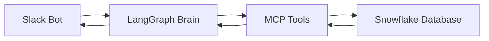

# Design Document

## Overview

The Slack Snowflake Agent is a Python application that lets users ask questions about data in plain English through Slack, and get answers back automatically. Here's how it works:

1. **User asks a question in Slack** (like "How many sales did we have last month?")
2. **LangGraph decides what to do** (understands it's a data question)
3. **MCP tools connect to Snowflake** (securely runs the SQL query)
4. **Results come back to Slack** (formatted nicely for the user)

Think of it like having a smart assistant in Slack that can talk to your database for you.

## Architecture

The system has 4 main parts:



**Simple Flow:**
1. **Slack Bot** - Listens for messages and sends responses
2. **LangGraph Brain** - Decides what to do with each message
3. **MCP Tools** - Safely connects to and queries Snowflake
4. **Snowflake Database** - Your actual data storage

## Components and Interfaces

### 1. Slack Bot (`slack_bot.py`)
**What it does:** Connects to Slack and handles messages
- Listens for @mentions and direct messages
- Sends formatted responses back to users
- Keeps track of conversations

### 2. LangGraph Workflow (`agent_workflow.py`)
**What it does:** The "brain" that decides what to do
- Reads the user's message
- Figures out if it's a data question
- Decides which tools to use
- Puts together the final response

**Simple workflow steps:**
1. **Understand** - What is the user asking?
2. **Plan** - What data do I need to get?
3. **Execute** - Run the query through MCP
4. **Format** - Make the results look nice for Slack

### 3. MCP Client (`mcp_client.py`)
**What it does:** Safely talks to Snowflake
- Connects to your Snowflake MCP server
- Runs SQL queries securely
- Handles authentication and permissions

### 4. Query Builder (`query_builder.py`)
**What it does:** Converts English to SQL
- Takes natural language questions
- Builds safe SQL queries
- Knows about your database structure

### 5. Response Formatter (`response_formatter.py`)
**What it does:** Makes data look good in Slack
- Turns SQL results into nice tables
- Creates simple charts when helpful
- Handles big results by showing summaries
- Formats everything for easy reading in Slack

## Key Python Files Structure

```
slack_snowflake_agent/
├── main.py                 # Starts everything up
├── slack_bot.py           # Handles Slack connections
├── agent_workflow.py      # LangGraph workflow logic
├── mcp_client.py          # Connects to MCP servers
├── query_builder.py       # Converts English to SQL
├── response_formatter.py  # Makes results look nice
└── config.py             # Settings and configuration
```

## Data Models

### Simple Data Classes

```python
from dataclasses import dataclass
from typing import List, Dict, Any, Optional

@dataclass
class UserMessage:
    """What the user said to us"""
    user_id: str
    channel_id: str
    text: str
    timestamp: str

@dataclass
class QueryResult:
    """What we got back from Snowflake"""
    sql_query: str
    data: List[Dict[str, Any]]  # The actual results
    row_count: int
    success: bool
    error_message: Optional[str] = None

@dataclass
class SlackResponse:
    """What we send back to Slack"""
    text: str
    formatted_table: Optional[str] = None
    chart_url: Optional[str] = None
```

## Error Handling

### What happens when things go wrong:

1. **User asks unclear question**
   - Bot asks for clarification: "Did you mean sales for this month or last month?"

2. **Snowflake is down**
   - Bot says: "Sorry, the database is temporarily unavailable. Please try again in a few minutes."

3. **User doesn't have permission**
   - Bot says: "You don't have access to that data. Contact your admin for help."

4. **Query takes too long**
   - Bot says: "That query is taking too long. Try asking for a smaller date range."

## Testing Strategy

### How we'll test it:

1. **Unit Tests** - Test each Python file individually
2. **Integration Tests** - Test the whole flow from Slack to Snowflake
3. **Manual Testing** - Actually try asking questions in Slack
4. **Security Tests** - Make sure bad queries can't break anything

## Security

### Keeping things safe:

1. **MCP handles all database connections** - No direct SQL access
2. **User permissions are checked** - People only see data they should
3. **Queries are validated** - No dangerous SQL can be run
4. **Everything is logged** - We track who asked what and when