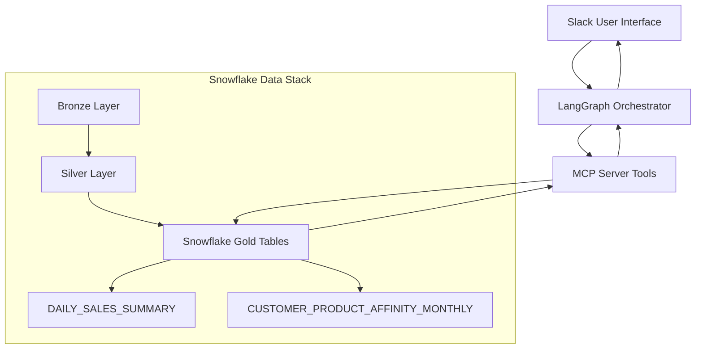

# Design Document

## Overview

The Slack Snowflake Agent bridges the gap between raw business questions and deep Snowflake insights by making curated Gold-layer data instantly accessible via natural language in Slack. The system targets business users, analysts, sales teams, and executives who need quick data insights without SQL knowledge or leaving their workflow.

**Core Problem Solved:** Users can't write SQL or don't have time to query dashboards, but they want instant answers in tools they already use (Slack) with contextual, conversational interaction.

**System Flow:**
1. **User asks a business question in Slack** (like "Which customer types spend the most?")
2. **LangGraph orchestrates the workflow** (maps question to appropriate Gold table)
3. **MCP tools securely query Snowflake** (targets specific Gold-layer tables like DAILY_SALES_SUMMARY)
4. **Conversational response in Slack** ("Premium customers spent $45K this month on Toys, while Regular customers spent $32K. Would you like a breakdown by category?")

**Milestone 1 Focus:** Handle simple, clear business questions targeting DAILY_SALES_SUMMARY and CUSTOMER_PRODUCT_AFFINITY_MONTHLY Gold tables.

## Architecture

The system leverages a modern Snowflake data stack (Bronze → Silver → Gold layers) with the agent specifically targeting Gold-layer tables for business insights:



**Component Roles:**
- **Slack Agent** - User interface for natural language queries
- **LangGraph** - Orchestrates NLP → tool → Snowflake → response logic
- **MCP Server** - Secure query execution, exposes tools to LLM, hides credentials
- **Snowflake Gold Tables** - Source of truth for curated business data
- **LLM** - Understands questions, routes to correct tools/tables

## Components and Interfaces

### 1. Main Entry Point (`main.py`)
**What it does:** Minimal entry point that starts the system
- Initializes configuration
- Starts the LangGraph workflow
- Handles graceful shutdown

### 2. LangGraph Workflow (`agent_workflow.py`)
**What it does:** The "brain" that orchestrates the entire flow
- Reads the user's message from Slack
- Figures out if it's a data question
- Decides which MCP tools to use
- Coordinates between Slack and Snowflake tools

**Simple workflow steps:**
1. **Understand** - What is the user asking?
2. **Plan** - What Gold table do I need to query?
3. **Execute** - Run the query through MCP tools
4. **Format** - Make the results look nice for Slack

### 3. MCP Core (`agent/core.py`)
**What it does:** Sets up the MCP server infrastructure
- Initializes MCP server with available tools
- Manages tool registration and discovery
- Handles MCP protocol communication

### 4. Snowflake Tools (`agent/tools/snowflake_tools.py`)
**What it does:** Encapsulates secure Snowflake access and query building
- Maps natural language to specific Gold tables (DAILY_SALES_SUMMARY, CUSTOMER_PRODUCT_AFFINITY_MONTHLY)
- Builds safe SQL queries targeting only Gold-layer tables
- Executes queries securely without exposing credentials
- Provides metadata about available Gold tables

### 5. Slack Tools (`agent/tools/slack_tools.py`)
**What it does:** Handles Slack integration and response formatting
- Connects to Slack and listens for messages
- Formats query results for Slack display
- Creates readable tables and summaries
- Manages conversational responses

## Milestone 1 Implementation Focus

### Target Gold Tables
- **DAILY_SALES_SUMMARY** - For questions like "What were daily sales this week?"
- **CUSTOMER_PRODUCT_AFFINITY_MONTHLY** - For questions like "Which customer types prefer which products?"

### Supported Question Patterns
1. **Daily Sales Queries** → DAILY_SALES_SUMMARY
   - "What were daily sales this week?"
   - "Which product categories are selling best?"
   - "How are Food vs Toys vs Automotive sales performing?"
   
2. **Customer Segment Queries** → DAILY_SALES_SUMMARY (aggregated)
   - "Which customer types spend the most?"
   - "How do Premium customers compare to Regular customers?"
   - "What do Unknown customers prefer to buy?"

3. **Product Performance Queries** → DAILY_SALES_SUMMARY (aggregated)
   - "What are the top selling products?"
   - "Which products generate the most revenue?"
   - "Show me popular products by category"

### Query Mapping Logic
The system will use pattern matching and intent recognition to map natural language to specific Gold tables, ensuring queries only target the curated, business-ready data layer.

## Key Python Files Structure

```
mcp-server-snowflake/
├── main.py                   # Entry point (minimal, already exists)
├── agent_workflow.py         # LangGraph workflow logic
├── config.py                 # Environment/config management
├── agent/                    # MCP server components
│   ├── __init__.py           # Package init
│   ├── core.py               # MCP server setup
│   └── tools/
│       ├── __init__.py       # Package init
│       ├── snowflake_tools.py # Gold table queries & mapping
│       └── slack_tools.py     # Slack response formatting
├── tests/                    # Test directory
├── pyproject.toml           # Project config
└── requirements.txt         # Dependencies 
```

## Data Models

### Simple Data Classes

```python
from dataclasses import dataclass
from typing import List, Dict, Any, Optional

@dataclass
class UserMessage:
    """What the user said to us"""
    user_id: str
    channel_id: str
    text: str
    timestamp: str

@dataclass
class QueryResult:
    """What we got back from Snowflake Gold tables"""
    sql_query: str
    gold_table_name: str  # e.g., "DAILY_SALES_SUMMARY"
    data: List[Dict[str, Any]]  # The actual results
    row_count: int
    success: bool
    error_message: Optional[str] = None

@dataclass
class SlackResponse:
    """What we send back to Slack"""
    text: str
    formatted_table: Optional[str] = None
    chart_url: Optional[str] = None
```

### Dependencies (from requirements.txt)
- **slack_sdk** - Slack Bot API integration
- **langgraph** - Workflow orchestration
- **openai** - LLM for natural language understanding
- **snowflake-connector-python** - Snowflake connectivity (via MCP)
- **python-dotenv** - Environment configuration
- **pytest** - Testing framework

## Error Handling

### What happens when things go wrong:

1. **User asks unclear question**
   - Bot asks for clarification: "Did you mean sales for this month or last month?"

2. **User asks question outside Milestone 1 scope**
   - Bot responds: "I can help with daily sales analysis, customer type comparisons, and product performance. Try asking 'What were daily sales this week?' or 'How do Premium customers compare to Regular customers?'"

3. **Snowflake Gold table is unavailable**
   - Bot says: "Sorry, the sales data is temporarily unavailable. Please try again in a few minutes."

4. **User doesn't have permission to Gold table**
   - Bot says: "You don't have access to that data. Contact your admin for help."

5. **Query takes too long**
   - Bot says: "That query is taking too long. Try asking for a smaller date range."

6. **MCP connection fails**
   - Bot says: "Unable to connect to data services. Please try again later."

## Testing Strategy

### How we'll test it:

1. **Unit Tests** - Test each Python file individually
2. **Integration Tests** - Test the whole flow from Slack to Snowflake
3. **Manual Testing** - Actually try asking questions in Slack
4. **Security Tests** - Make sure bad queries can't break anything

## Security

### Keeping things safe:

1. **MCP encapsulates all Snowflake access** - No direct database credentials in Slack environment
2. **Gold-layer only queries** - System restricted to curated, business-ready tables only
3. **User permissions enforced** - MCP respects Snowflake user-level access controls
4. **Query validation** - Only approved Gold table queries can be executed
5. **Comprehensive logging** - All queries, users, and results tracked for audit
6. **Tool-based access control** - MCP tools provide granular control over data operations

## Real Data Structure

### DAILY_SALES_SUMMARY Table Schema
- `TRANSACTION_DATE` (DATE) - Daily transaction dates
- `PRODUCT_ID` (NUMBER) - Product identifier  
- `PRODUCT_NAME` (TEXT) - Product names (e.g., "Product 774")
- `PRODUCT_CATEGORY` (TEXT) - Categories: **Food, Automotive, Toys**
- `CUSTOMER_ID` (NUMBER) - Customer identifier
- `CUSTOMER_TYPE` (TEXT) - Customer segments: **Unknown, Regular, Premium**
- `TOTAL_QUANTITY_SOLD` (NUMBER) - Units sold per transaction
- `TOTAL_REVENUE` (FLOAT) - Revenue per transaction
- `AVG_PRICE_PER_UNIT` (FLOAT) - Average unit price
- `AVG_REVENUE_PER_TRANSACTION` (FLOAT) - Average transaction value

### CUSTOMER_PRODUCT_AFFINITY_MONTHLY Table Schema
- `CUSTOMER_ID` (NUMBER) - Customer identifier
- `CUSTOMER_TYPE` (TEXT) - Customer segments: **Unknown, Regular, Premium**
- `PRODUCT_ID` (NUMBER) - Product identifier
- `PRODUCT_NAME` (TEXT) - Product name
- `PRODUCT_CATEGORY` (TEXT) - Product categories: **Food, Automotive, Toys**
- `PURCHASE_MONTH` (DATE) - Monthly aggregation period
- `PURCHASE_COUNT` (NUMBER) - Number of purchases in month
- `TOTAL_QUANTITY` (NUMBER) - Total units purchased
- `TOTAL_SPENT` (FLOAT) - Total spending amount
- `AVG_PURCHASE_AMOUNT` (FLOAT) - Average purchase value
- `DAYS_BETWEEN_FIRST_LAST_PURCHASE` (NUMBER) - Purchase frequency indicator